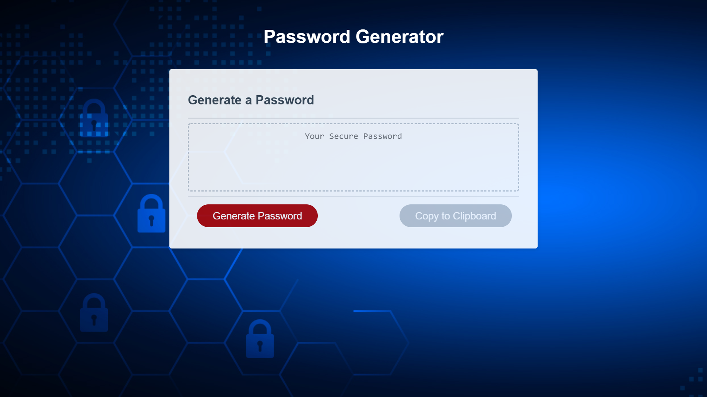

# Password Generator

    Random password generator with multiple choice of options to include in the password.

    Built using HTML, CSS, and Javascript.

___________________________________________________________________________________________________________________

**Install**
    -Clone Repository
    -Open Index.html

___________________________________________________________________________________________________________________

**Usage**

    -Click the generate password button then choose the options to include in the password. (OK=Yes, Cancel=NO)
    -When done the random passsword is genertated in the textarea.
    -Click the copy to clipboard button to copy the password.
